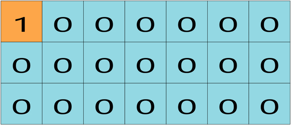

# visual your algo
visual your algo(下称vua)主要是用于从自定义的代码中把算法运行过程可视化地展示出来,与同类型网站[Algorithm Visualizer](https://github.com/algorithm-visualizer/algorithm-visualizer)相比，vua最大的优点在于使用简单,相比于Algorithm Visualizer需要在代码中显示地调用可视化的代码,vua自动化地记录代码的运行过程,这使得很容易把现有的代码修改为可被vua处理的代码

以[leetcode 62. Unique Paths](https://leetcode.com/problems/unique-paths/)为例来演示整个系统的用法
对于这道题可以再discuss区找到别人的[ac代码](https://leetcode.com/problems/unique-paths/discuss/934807/Two-JS-Solutions) 引用如下
```javascript
  // Bottom-Up approach
  var uniquePaths = function(m, n) {
    let dp = new Array(m).fill(0).map(() => new Array(n));
    // dp[r][c] represents the number of possible paths from row = 0, col = 0 to row = r, col = c
    for (let row = 0; row < m; row++) {
      for (let col = 0; col < n; col++) { if (row == 0 || col == 0) { // there is only one path to any point in first row or first column since robot can only move right or down
          dp[row][col] = 1;
        } else {
          dp[row][col] = dp[row-1][col] + dp[row][col-1];
        }
      }
    }
    return dp[m-1][n-1];
    // Time Complexity: O(m*n)
    // Space Complexity: O(m*n), for dp table
  };
```
为了使用vua 我们需要把
```
  let dp = new Array(m).fill(0).map(() => new Array(n));
```
这行写为vua专用的容器 在这里我们选择vuaMatrix(稍后会详细说明该容器的用法) 将代码改为
```
  let dp = new vuaMatrix(m, n, 0);
```
然后再往代码最后添加对该函数的调用
```
  uniquePaths(3, 7);
```
就完成了对从普通的代码到vua可处理代码的转换 最终代码如下
```javascript
  // Bottom-Up approach
  var uniquePaths = function(m, n) {
  let dp = new vuaMatrix(m, n, 0);
    // dp[r][c] represents the number of possible paths from row = 0, col = 0 to row = r, col = c
    for (let row = 0; row < m; row++) {
      for (let col = 0; col < n; col++) {
        if (row == 0 || col == 0) { // there is only one path to any point in first row or first column since robot can only move right or down
          dp[row][col] = 1;
        } else {
          dp[row][col] = dp[row-1][col] + dp[row][col-1];
        }
      }
    }
    return dp[m-1][n-1];
    // Time Complexity: O(m*n)
    // Space Complexity: O(m*n), for dp table
  };
  uniquePaths(3, 7);
```
以上代码就可以提交到vua网站观察效果了 运行效果如下

