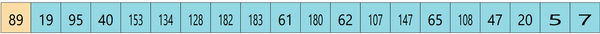
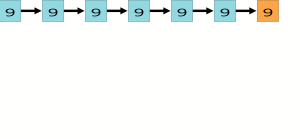

# visual your algo
visual your algo(下称vua)主要是用于从自定义的代码中把算法运行过程可视化地展示出来,与同类型网站[Algorithm Visualizer](https://github.com/algorithm-visualizer/algorithm-visualizer)相比，vua最大的优点在于使用简单,相比于Algorithm Visualizer需要在代码中显示地调用可视化的代码,vua自动化地记录代码的运行过程,这使得很容易把现有的代码修改为可被vua处理的代码

以[leetcode 62. Unique Paths](https://leetcode.com/problems/unique-paths/)为例来演示整个系统的用法
对于这道题可以再discuss区找到别人的[ac代码](https://leetcode.com/problems/unique-paths/discuss/934807/Two-JS-Solutions) 引用如下
```javascript
  // Bottom-Up approach
  var uniquePaths = function(m, n) {
    let dp = new Array(m).fill(0).map(() => new Array(n));
    // dp[r][c] represents the number of possible paths from row = 0, col = 0 to row = r, col = c
    for (let row = 0; row < m; row++) {
      for (let col = 0; col < n; col++) { if (row == 0 || col == 0) { // there is only one path to any point in first row or first column since robot can only move right or down
          dp[row][col] = 1;
        } else {
          dp[row][col] = dp[row-1][col] + dp[row][col-1];
        }
      }
    }
    return dp[m-1][n-1];
    // Time Complexity: O(m*n)
    // Space Complexity: O(m*n), for dp table
  };
```
为了使用vua 我们需要把
```
  let dp = new Array(m).fill(0).map(() => new Array(n));
```
这行写为vua专用的容器 在这里我们选择vuaMatrix(稍后会详细说明该容器的用法) 将代码改为
```
  let dp = new vuaMatrix(m, n, 0);
```
然后再往代码最后添加对该函数的调用
```
  uniquePaths(3, 7);
```
就完成了对从普通的代码到vua可处理代码的转换 最终代码如下
```javascript
  // Bottom-Up approach
  var uniquePaths = function(m, n) {
  let dp = new vuaMatrix(m, n, 0);
    // dp[r][c] represents the number of possible paths from row = 0, col = 0 to row = r, col = c
    for (let row = 0; row < m; row++) {
      for (let col = 0; col < n; col++) {
        if (row == 0 || col == 0) { // there is only one path to any point in first row or first column since robot can only move right or down
          dp[row][col] = 1;
        } else {
          dp[row][col] = dp[row-1][col] + dp[row][col-1];
        }
      }
    }
    return dp[m-1][n-1];
    // Time Complexity: O(m*n)
    // Space Complexity: O(m*n), for dp table
  };
  uniquePaths(3, 7);
```
以上代码就可以提交到vua网站观察效果了 运行效果如下


# API

## vuaVector
  vuaVector, 该容器实际上是Array类型加了代理后得到的 所以该容器可以当成Array来用 其初始化方法也和Array类型一致 但是该方法仅支持使用new初始化 这个容器以[TopK问题作为例子](https://leetcode-cn.com/problems/zui-xiao-de-kge-shu-lcof/) 我们将该题的一个[ac代码](https://xxoo521.com/2020-02-21-least-nums/)重写为以下形式
```javascript
  function partiton(arr, start, end) {
    const k = arr[start];
    let left = start + 1,
        right = end;
    while (1) {
      while (left <= end && arr[left] <= k) ++left;
      while (right >= start + 1 && arr[right] >= k) --right;

      if (left >= right) {
        break;
      }

      [arr[left], arr[right]] = [arr[right], arr[left]];
      ++left;
      --right;
    }
    [arr[right], arr[start]] = [arr[start], arr[right]];
    return right;
  }

  var getLeastNumbers = function (arr, k) {
    const length = arr.length;
    if (k >= length) return arr;
    let left = 0,
        right = length - 1;
    let index = partiton(arr, left, right);
    while (index !== k) {
      if (index < k) {
        left = index + 1;
        index = partiton(arr, left, right);
      } else if (index > k) {
        right = index - 1;
        index = partiton(arr, left, right);
      }
    }

    return arr.slice(0, k);
  };

  //###############################################################
  const data = new vuaVector(...[89, 19, 95, 40, 153, 134, 128, 182, 183, 61, 180, 62, 107, 147, 65, 108, 47, 20, 5,  7]);
  getLeastNumbers(data, 7);
  //###############################################################
```
我们仅仅添加了最后两行被#包围的两行代码 其余代码与原作者保持一致
以上代码就可以提交到vua网站观察效果了 运行效果如下


## vuaMatrix
  vuaMatrix, 该容器的初始化方式为new vuaMatrix(numberOfRow, numberOfCol, cellValue); 与一般的二维数组使用方法类似 但是注意该容器大小在初始化的时候就定下了 不能修改行数或者列数 具体使用实例参考Unique Paths那个实例

## vuaSinglyLinkedListHead vuaSinglyLinkedListNode
  vuaSinglyLinkedListHead vuaSinglyLinkedListNode是两个单链表的相关引用类型 其原型如下
```javascript
  function vuaSinglyLinkedListHead(next = null) {
    this.next = null;
  }
  function vuaSinglyLinkedListNode(value = 0, next = null) {
    this.value = value;
    this.next = null;
  }
```
  这两个类的使用很简单 正常使用就好 有两个问题需要注意的是 
  第一 简单声明一个vuaSinglyLinkedListNode实例是无法可视化的 只有当vuaSinglyLinkedListNode接在vuaSinglyLinkedListHead上的时候 才会被显示出来 
  第二 vuaSinglyLinkedList暂时还不支持环形链表 这是个将来会支持的功能 但现在还不支持
  以上两个注意事项也适用于二叉树和多叉树中
  在有了以上铺垫后 以[leetcode 2. Add Two Numbers](https://leetcode.com/problems/add-two-numbers/)来作为一个示例
  依旧在讨论区找到一个[ac代码](https://leetcode.com/problems/add-two-numbers/discuss/1595/An-Ordinary-JavaScript-Solution)并将其稍微修改为vua能识别的样子 修改如下
```javascript
  var addTwoNumbers = function(l1, l2) {
    if (l1===null) return l2;
    if (l2===null) return l1;

    //new a ListNode here, with head.next as header, pos as a pointer points to current position
    // var head = new ListNode(0);
    var head = new vuaSinglyLinkedListHead();

    var pos = head;
    var temp = 0;
    while (l2!==null || l1!==null || temp>0){

      //(l2!==null || l1!==null || temp>0) indicates that next digit is not null, so new a Node and move to it
      pos.next = new vuaSinglyLinkedListNode(0);
      pos = pos.next;

      if (l1!==null){
        temp += l1.value;
        l1 = l1.next;
      }
      if (l2!==null){
        temp += l2.value;
        l2 = l2.next;
      }

      pos.value = temp%10;
      temp = parseInt(temp/10);
      //console.log(temp);
    }
    return head.next;
  };

  const l1 = new vuaSinglyLinkedListHead(fromArrayToLinkedList([9, 9, 9, 9, 9, 9, 9]));
  const l2 = new vuaSinglyLinkedListHead(fromArrayToLinkedList([9, 9, 9, 9]));
  addTwoNumbers(l1.next, l2.next);
```
  主要改动的地方为将vuaSinglyLinkedListHead vuaSinglyLinkedListHead引入代码并将.val改为.value 其中 我们调用了一个方法来构造单链表测试用例 fromArrayToLinkedList 该方法不是vua的容器 是一个vua提供的一个方法 这个方法会在后面的文档中有详细介绍
  以上代码就可以提交到vua网站观察效果了 运行效果如下
  
## vuaBinaryTreeHead vuaBinaryTreeNode
  vuaBinaryTreeHead vuaBinaryTreeNode是两个二叉树的相关引用类型 其原型如下
```javascript
  function vuaBinaryTreeHead(next = null) {
    this.next = null;
  }
  function vuaBinaryTreeNode(value = 0, left = null, right = null) {
    this.value = value;
    this.left = left;
    this.right = right;
  }
```
  这两个类的使用很简单 正常使用就好 有个问题需要注意的是 简单声明一个vuaBinaryTreeNode实例是无法可视化的 只有当vuaBinaryTreeNode接在vuaBinaryTreeHead上的时候 才会被显示出来 
  在有了以上铺垫后 以[leetcode 98. Validate Binary Search Tree](https://leetcode.com/problems/validate-binary-search-tree/)来作为一个示例
  依旧在讨论区找到一个[ac代码](https://leetcode.com/problems/validate-binary-search-tree/discuss/529937/javascript-%3A-97-faster-simple-recursion)并将其稍微修改为vua能识别的样子 修改如下
```javascript
  var isValidBST = function(root, min=null, max=null) {
    if (!root) return true;
    if (min && root.value <= min.value) return false;
    if (max && root.value >= max.value) return false;
    return isValidBST(root.left, min, root) && isValidBST(root.right, root, max);
  };

  const head = new vuaBinaryTreeHead();
  head.next = fromArrayToBinaryTree([5, 1, 4, null, null, 3, 6]);
  isValidBST(head.next);
```
  主要改动的地方为将vuaBinaryTreeHead vuaBinaryTreeHead引入代码并将.val改为.value 其中 我们调用了一个方法来构造二叉树测试用例 fromArrayToBinaryTree 该方法不是vua的容器 是一个vua提供的一个方法 这个方法会在后面的文档中有详细介绍
  以上代码就可以提交到vua网站观察效果了 运行效果如下
  

## vuaMAryTreeHead vuaMAryTreeNode
  vuaMAryTreeHead vuaMAryTreeNode是两个多叉树的相关引用类型 其原型如下
```javascript
  function vuaMAryTreeHead(next = null) {
    this.next = null;
  }
  function vuaMAryTreeNode(value = 0) {
    this.value = value;
    this.children = [];
  }
```
  这两个类的使用很简单 正常使用就好 有两个问题需要注意的是 
  1. 简单声明一个vuaMAryTreeNode实例是无法可视化的 只有当vuaMAryTreeNode接在vuaMAryTreeHead上的时候 才会被显示出来 
  2. 多叉树的子节点实现方式在这里采用的是用数组来存储的 而不是儿子-兄弟的存储方法 所以Array里的push等方法在chilren里也是可以用的
    在有了以上铺垫后 以[leetcode 559. Maximum Depth of N-ary Tree](https://leetcode.com/problems/maximum-depth-of-n-ary-tree/)来作为一个示例
    依旧在讨论区找到一个[ac代码](https://leetcode.com/problems/maximum-depth-of-n-ary-tree/discuss/374244/Javascript-recursive-solution)并将其稍微修改为vua能识别的样子 修改如下
```javascript
  var maxDepth = function(root) {
    root.value;
    if (root == null) {
      return 0;
    }

    let max = 0;
    for (let child of root.children) {
      max = Math.max(max, maxDepth(child));
    }

    return max + 1;
  };
  const data = [1, null, 2, 3, 4, 5, null, null, 6, 7, null, 8, null, 9, 10, null, null, 11, null, 12, null, 13, null, null, 14];
  const head = new vuaMAryTreeHead();
  head.next = fromArrayToMAryTree(data);
  maxDepth(head.next);
```
  主要改动的地方为将vuaMAryTreeHead vuaMAryTreeHead引入代码并将.val改为.value 其中 我们调用了一个方法来构造多叉树测试用例 fromArrayToMAryTree 该方法不是vua的容器 是一个vua提供的一个方法 这个方法会在后面的文档中有详细介绍
  其中在maxDepth中加入了一个root.value一句 这句是必须的 这是为了启动多叉树的高亮
  以上代码就可以提交到vua网站观察效果了 运行效果如下
  

## addListener
  addListener并不是一个容器 而是一个方法 他可以用来可视化递归栈的一个调用过程 因为本质上来说 任何递归调用的过程都可以画成一个多叉树的过程 使用方法也很简单 如下所示
```javascript
  function functionName(/*parameters*/) {
    //body
  }
  functionName = addListener(functionName);
```
  然后functionName该怎么用怎么用 不过有个需要注意的问题是 必须对functionName进行覆盖 而不是用另一个变量名来承接addListener的返回值 不然的话functionName函数体内部的递归调用就无法被探测到
  在有了以上铺垫后 我们还以[leetcode 559. Maximum Depth of N-ary Tree](https://leetcode.com/problems/maximum-depth-of-n-ary-tree/)来作为一个示例, 就是上面那个例子再重用一下 因为作者并不想再去找另一个例子了
  依旧在讨论区找到一个[ac代码](https://leetcode.com/problems/maximum-depth-of-n-ary-tree/discuss/374244/Javascript-recursive-solution)并将其稍微修改为vua能识别的样子 修改如下
```javascript
  var maxDepth = function(root) {
    root.value;
    if (root == null) {
      return 0;
    }

    let max = 0;
    for (let child of root.children) {
      max = Math.max(max, maxDepth(child));
    }

    return max + 1;
  };
  const data = [1, null, 2, 3, 4, 5, null, null, 6, 7, null, 8, null, 9, 10, null, null, 11, null, 12, null, 13, null, null, 14];
  const head = new vuaMAryTreeHead();
  head.next = fromArrayToMAryTree(data);
  maxDepth = addListener(maxDepth);//########
  maxDepth(head.next);
```
  在这段代码里 仅在倒数第二段添加了一行代码 其他的不变
  以上代码就可以提交到vua网站观察效果了 运行效果如下
  
  可以看到在最后递归生成的树就是和原本树的形状是一样的 这也就是遍历树的时候递归调用栈的一个过程
